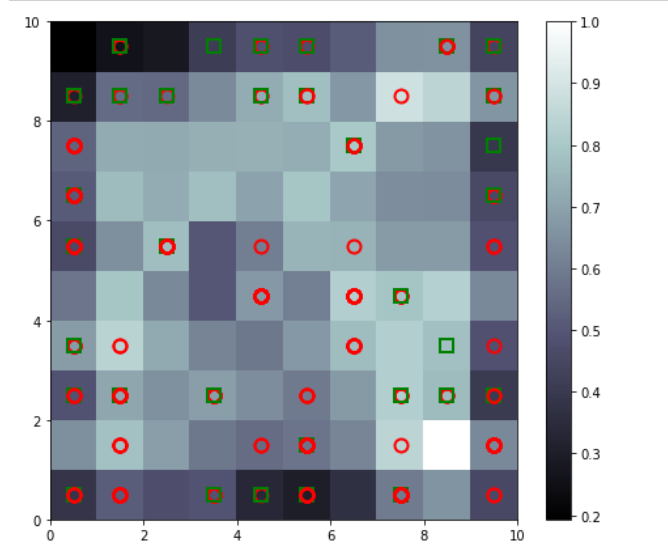

# Unsupervised Deep Learning
--------------------------------
Soms, Boltzman Machines, AutoEncoders

## Self - Organizing Maps

#### Used to Identify Potential Relationship between data of high Dimensionality and map it on 2D.

